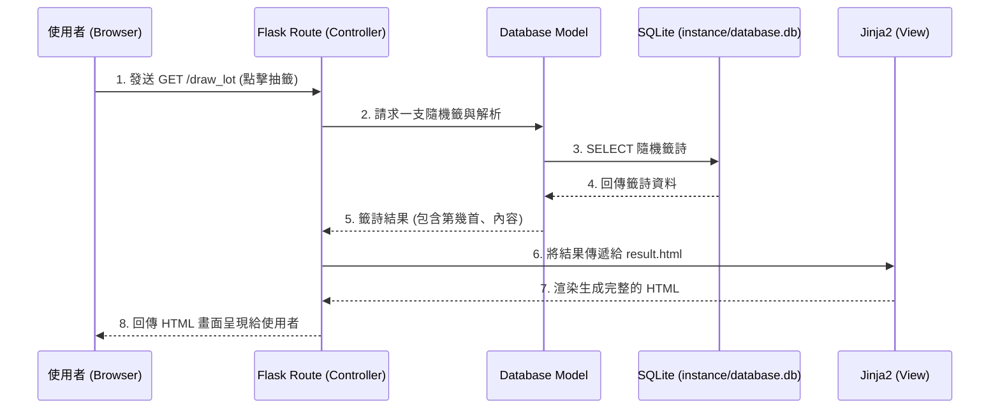

# 算命系統 架構設計文件 (Architecture Document)

此文件根據 `docs/PRD.md` 的功能需求，定義了線上算命系統的技術架構與資料夾結構。

## 1. 技術架構說明

本專案採用傳統的伺服器渲染 (Server-Side Rendering) 架構，不進行前後端分離，以求快速開發與迭代。

- **選定技術與原因**：
  - **後端 (Python + Flask)**：Flask 是輕量級的網頁框架，因為算命網站邏輯不複雜且學習曲線低，非常適合做為此系統的後端。
  - **視圖層/模板 (Jinja2)**：直接整合在 Flask 當中，用於將後端的資料與算命結果動態渲染成 HTML 呈現給使用者。
  - **資料庫 (SQLite)**：不用額外架設資料庫伺服器，資料儲存在單一檔案中，適合輕量級應用、專案初期與 MVP 開發。

- **Flask MVC 模式對應說明**：
  雖然 Flask 不是預設為嚴格的 MVC 框架，但我們團隊將按照 MVC 的邏輯來劃分職責：
  - **M（Model - 模型）**：負責與 SQLite 溝通，處理「使用者資訊」、「抽籤紀錄」的增刪改查（CRUD）操作。
  - **V（View - 視圖）**：為 Jinja2 模板，負責所有 HTML 呈現以及顯示算命結果和解析。
  - **C（Controller - 控制器/路由）**：Flask 的 Route 負責處理傳入的瀏覽器請求（如使用者點擊「抽籤」），呼叫 Model 交換資料後，將結果交給對應的 View（Jinja2）進行頁面渲染。

## 2. 專案資料夾結構

設計規劃的專案結構如下，重點是讓分工與職責更加明確清楚。

```text
web_app_development/
│
├── app.py                ← 應用程式的主要入口，啟動 Flask Server
├── requirements.txt      ← 記錄 Python 套件依賴（如 Flask 等）
│
├── app/                  ← 核心應用程式資料夾
│   ├── __init__.py       ← 初始化 Flask App 與設定
│   ├── routes/           ← 存放所有的 Controller（Flask 路由）
│   │   ├── __init__.py
│   │   ├── main.py       ← 主頁、算命種類選擇
│   │   ├── auth.py       ← 註冊、登入與登出邏輯
│   │   └── fortune.py    ← 抽籤、儲存結果、捐錢邏輯
│   │
│   ├── models/           ← 與資料庫互動的模型
│   │   ├── __init__.py
│   │   └── database.py   ← 封裝 SQLite 初始化與基本的 CRUD 語法
│   │
│   ├── templates/        ← 存放 Jinja2 HTML 模板
│   │   ├── base.html     ← 共用模板 (含 Navbar, Footer)
│   │   ├── index.html    ← 首頁
│   │   ├── login.html    ← 登入 / 註冊頁面
│   │   └── result.html   ← 籤詩與算命結果顯示頁面
│   │
│   └── static/           ← 靜態資源檔案
│       ├── css/
│       │   └── style.css ← 各頁面共用樣式設計
│       ├── js/
│       │   └── main.js   ← 抽籤動畫、微互動腳本
│       └── images/       ← 籤詩圖片、圖示背景等媒體
│
├── instance/             ← 放置與環境、機密相關或自動生成的檔案
│   └── database.db       ← 開發與運行的 SQLite 實際資料庫檔案
│
└── docs/                 ← 開發文件、PRD 與架構圖
    ├── PRD.md
    └── ARCHITECTURE.md
```

## 3. 元件關係圖

以下展示當使用者點擊「進行抽籤」時，系統元件如何彼此互動。



## 4. 關鍵設計決策

1. **捨棄前後端分離架構**
   - **原因**：為了加速初期 MVP 的上線時程與降低開發複雜度。所有頁面交由後端 Flask 結合 Jinja2 渲染可以更快速地完成權限控制與資料呈現，也不需額外維護 API 協定與前端框架狀態。
2. **使用原生的 SQLite**
   - **原因**：算命網站偏向讀多寫少的應用場景（大部分在讀取籤詩，少部分在寫入紀錄），SQLite 寫入鎖定的特性影響不大，且無須配置 DB 伺服器，對個人/初期專案最為便利。
3. **路由 (Routes) 依功能拆分**
   - **原因**：為了避免所有的 API 全部塞進單一的 `app.py` 中，我們在 `app/routes/` 下依照功能切割為 `auth.py`, `fortune.py`, `main.py`。這能維持代碼可讀性，未來就算功能擴充也不容易亂成一團。
4. **保留 `static/js` 搭配微互動**
   - **原因**：雖然主要渲染靠後端，但算命的精髓在於「儀式感」。保留簡單的原生 Javascript，可以在這層製作「搖籤筒動畫」或是「擲筊轉動」的微互動，大幅提升整體服務的使用者體驗 (UX)。
