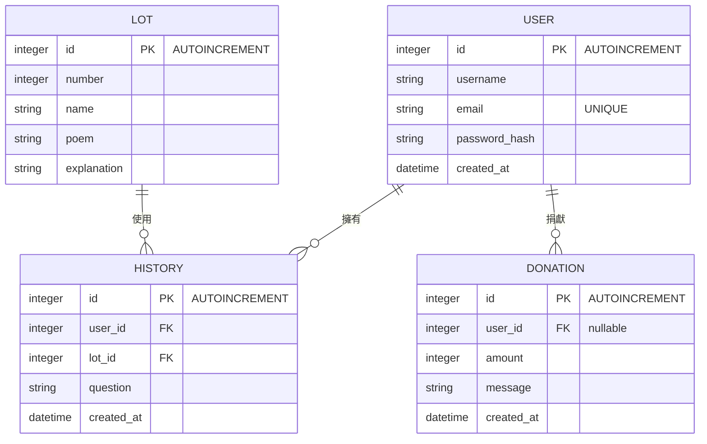

# 資料庫設計 (DB Design)

本系統使用 SQLite，主要處理四個資料表。

## ER 圖

## 資料表詳細說明

### USER (使用者表)
儲存註冊使用者的帳號名稱與權限密碼等。
- `id`: INTEGER PK, 自動遞增。
- `username`: TEXT, 必填。
- `email`: TEXT, 必填，UNIQUE。
- `password_hash`: TEXT, 必填。
- `created_at`: TEXT, 註冊時間。

### LOT (籤詩庫)
儲存靜態的籤詩內容及對應的白話文解析。
- `id`: INTEGER PK, 自動遞增。
- `number`: INTEGER, 第幾首籤。
- `name`: TEXT, 籤名 (例如：甲子)。
- `poem`: TEXT, 籤詩原文。
- `explanation`: TEXT, 白話文解析。

### HISTORY (抽籤紀錄)
儲存每次使用者抽籤的結果。
- `id`: INTEGER PK, 自動遞增。
- `user_id`: INTEGER, 必填 (關聯 USER.id)。
- `lot_id`: INTEGER, 必填 (關聯 LOT.id)。
- `question`: TEXT, 可選，祈求的問題。
- `created_at`: TEXT, 建立時間。

### DONATION (香油錢)
儲存線上香油錢捐獻紀錄。
- `id`: INTEGER PK, 自動遞增。
- `user_id`: INTEGER, 可選 (關聯 USER.id，允許訪客捐款)。
- `amount`: INTEGER, 必填，捐款金額。
- `message`: TEXT, 可選，祈福語。
- `created_at`: TEXT, 建立時間。
