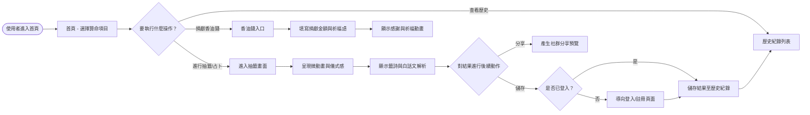
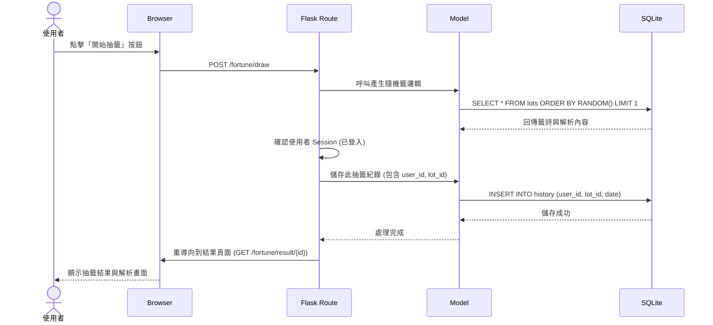

# 算命系統 流程圖 (Flowchart & Sequence Diagram)

根據需求規格書 (PRD) 與系統架構文件 (Architecture)，此文件定義了使用者的操作流程、後端處理的序列圖，以及系統初步的路由設計對照表。

## 1. 使用者流程圖 (User Flow)

描述使用者從進入首頁後，到抽籤、查看紀錄與捐香油錢的整體操作路徑。

## 2. 系統序列圖 (Sequence Diagram)

以下以系統中最核心的「**登入使用者進行抽籤並自動儲存結果**」為例，展示前端瀏覽器、Flask 路由、Model 與 SQLite 之間的資料流動。

## 3. 功能清單對照表

本表格列出系統主要功能、對應的 URL 路徑 (Routes) 與適用的 HTTP 方法，供後續實作對齊使用。

| 功能模組 | 頁面/功能說明 | URL 路徑 | HTTP 方法 |
| -- | -- | -- | -- |
| **首頁** | 網站首頁，顯示系統介紹與功能入口 | `/` | GET |
| **會員系統** | 顯示註冊頁面 / 提交註冊表單 | `/register` | GET / POST |
| **會員系統** | 顯示登入頁面 / 提交登入表單 | `/login` | GET / POST |
| **會員系統** | 使用者登出 (清除 Session) | `/logout` | GET |
| **算命功能** | 顯示抽籤畫面 / 送出抽籤請求 | `/fortune/draw` | GET / POST |
| **算命功能** | 顯示特定一筆籤詩與解析 | `/fortune/result/<id>` | GET |
| **歷史紀錄** | 檢視個人過去的抽籤與算命結果 | `/history` | GET |
| **香油錢** | 顯示捐款畫面 / 送出虛擬捐款表單 | `/donate` | GET / POST |
